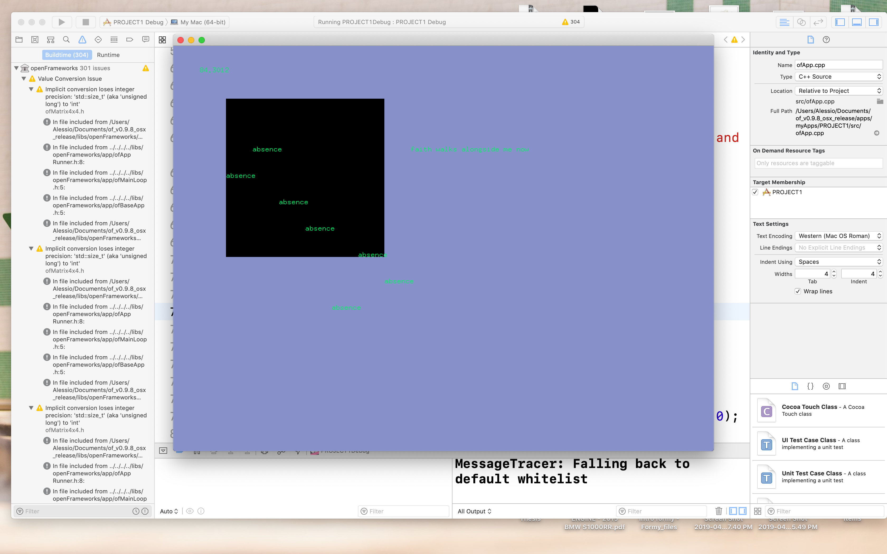

Project 1 explores the usage of simple movement of 2D shapes to create a rythm within storytelling, and time-based transition and color to accompany the theme of sudden loss. Understanding how to use modulo was definitely a goal of mine since I never properly understood it before- math is not my strong suit. I wanted to see how well I could convey meaning through shapes but ultimately I knew that words would have to make up for it. Hopefully this personal exploration was effective more than just for myself. 

https://www.youtube.com/watch?v=b1HwOz3FwAo&feature=youtu.be
