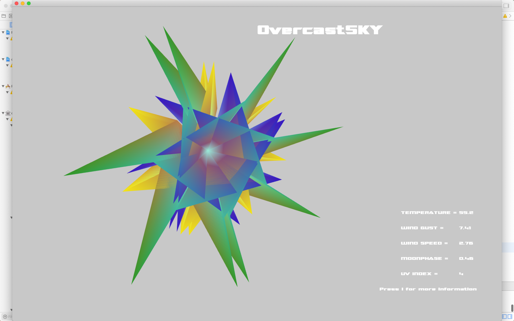

Project 2 was about creating an application that could recieve API data. I chose to use UV index, wind Gust and Wind speed as my most prominent parameters since I feel these are often overlooked although they do quite a lot to impact our perception of the weather. This was by far my most engaging project, as I was learning how to use VBOs through OpenGL.

https://www.youtube.com/watch?v=9A2vWZ5mfJg&feature=youtu.be
