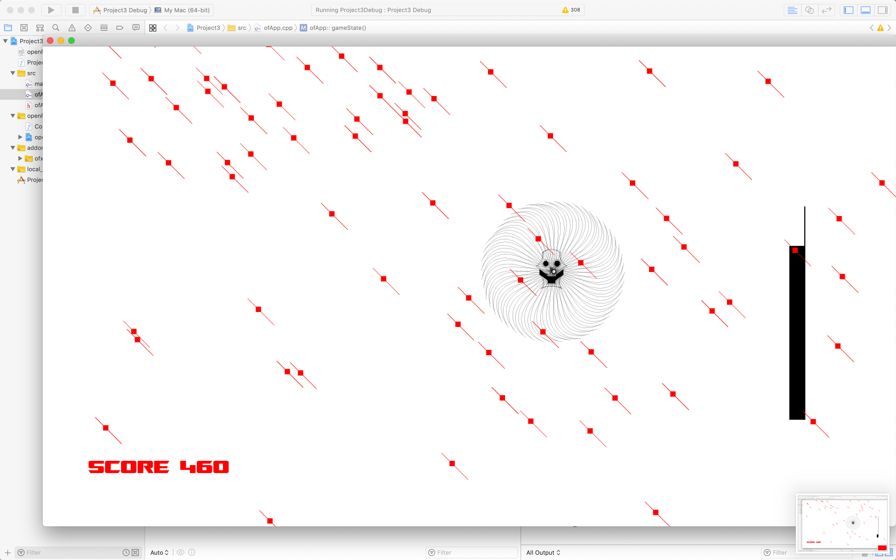

Project 3 involved creating an interactive game. I wanted to take the time to make an interesting character, so I imported images of one I designed from illustrator. As part of the mechanics, my character can gain temporary invulnerability. The goal is simple, to survive. Proper collision interaction was important, as was a seamless user experience. I wanted to make a background for the scene but ultimately the visuals of the particles were quite nice. I felt that the style was coherent in general, but I do wish I could have done better with the movement and more intuitive collision. I regret not being able to use OpenGl.

https://www.youtube.com/watch?v=KWpPx3Txy5k&feature=youtu.be
